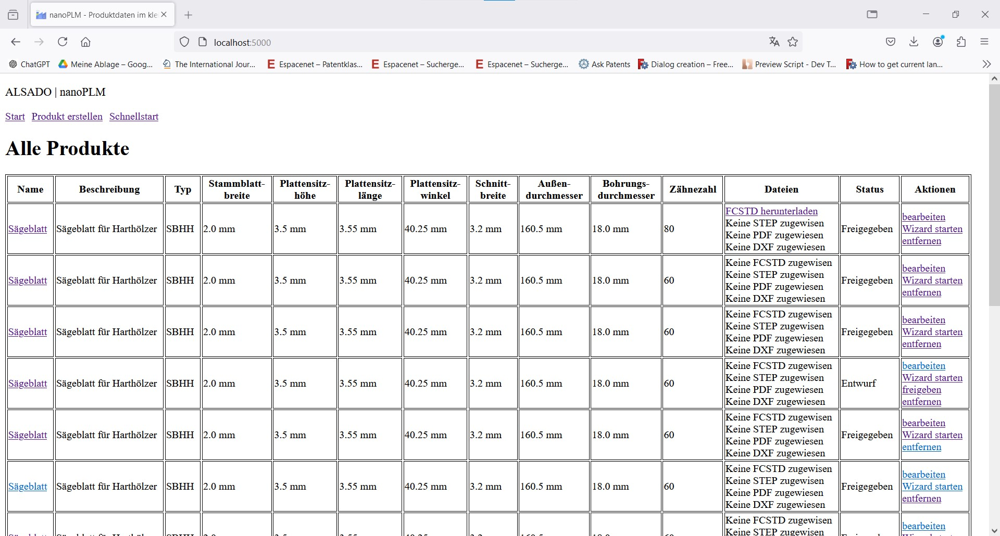

# nanoPLM
Open source PLM solution for small machine manufacturers - intended to be used with FreeCAD.
- Run locally without an internet connection.
- Keep all your data private.
- Focusing on ease of use - even beginners can install and use it.
- Automate your FreeCAD workflows from a central place.
- Compatible with Windows 10

:point_right: Download nanoPLM (exe, Windows 10, FreeCAD 0.21): 
[https://github.com/alekssadowski95/nanoPLM/releases/latest/download/openplm.zip](https://github.com/alekssadowski95/nanoPLM/releases/latest/download/openplm.zip)

:point_right: Watch nanoPLM Video Overview: 
[https://youtu.be/8V5PVpD8dvw](https://youtu.be/8V5PVpD8dvw)

## Product Development and Manufacturing Cycle in the European Union

*nanoPLM* follows the following workflow from product development and manufacturing:
1. Technology research (Patents, scientific publications, existing products, catalogues)
2. Concept (Quick drawing (hand/powerpoint) with all its components and external effects)
3. Product safety assessment (Directive 2001/95/EC, risk assessment, ...)
4. Preliminary design (analytical calculations)
5. Detailed design (3D CAD, manufacturing and assembly drawings, simulation)
6. Testing (if necessary (safety, functional))
7. Manufacturing (in-house/ outsourced, development and manufacturing of manufacturing aids)
8. Quality assurance (100% control/ sample)

## Manage your product data in a small team
- Material id, image, name, description
- 3D CAD, drawings
- Patent documents (IP)
- Product brochures
- Machinery directive, CE marking, risk assessment, instructions manual, declaration of conformity
- Price buying, price selling
- ...
