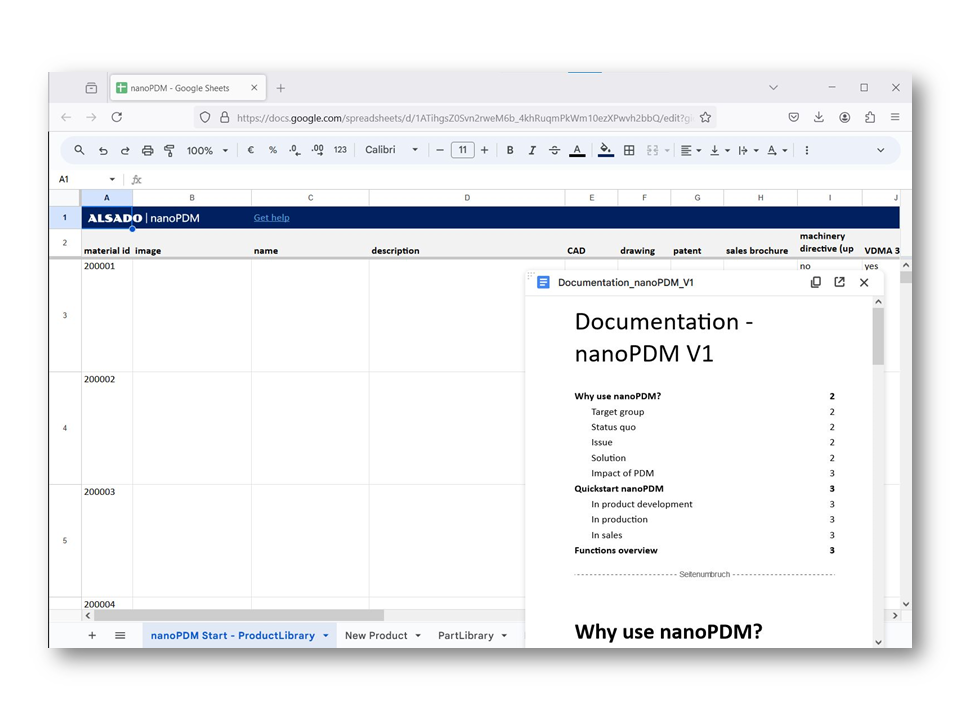

# nanoPLM
Open source PLM solution for small machine manufacturers - intended to be used with FreeCAD.

Manage your product data in a small team.

nanoPLM V1: [https://drive.google.com/drive/folders/1hJgDOYAihrBrVB-M3uM-DApLE-M_Vy-x?usp=sharing](https://drive.google.com/drive/folders/1hJgDOYAihrBrVB-M3uM-DApLE-M_Vy-x?usp=sharing)

nanoPLM V1 Documentation: [https://drive.google.com/drive/folders/1kpGPj2jRL9byPt5izNbg5AgFY43apW_G?usp=sharing](https://drive.google.com/drive/folders/1kpGPj2jRL9byPt5izNbg5AgFY43apW_G?usp=sharing)

