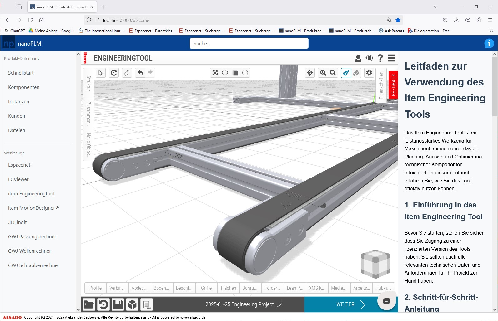

# nanoPLM - Open-Source PLM

## What is nanoPLM?
nanoPLM is an Open-Source PLM for small machine manufacturers - natively supports FreeCAD 

- Run locally without an internet connection.
- Keep all your data private.
- Focusing on ease of use - even beginners can install and use it.
- Priority treatment of FreeCAD compared to other CAD software, with the aim to further spread the word about it and making more manufacturers transition to FreeCAD.
- Automate your FreeCAD workflows from a central place.
- Support for all relevant languages in manufacturing, including English, German, French and others.
- Unique features that enable small manufacturers to compete against the big players.
- Compatible with Windows 10

Watch nanoPLM Video Overview: 
[https://youtu.be/8V5PVpD8dvw](https://youtu.be/8V5PVpD8dvw)

nanoPLM also got announced at FOSDEM 2025 in my talk about "Product development in mechanical engineering using open-source software".

## Get nanoPLM

Demo nanoPLM now:
[https://aleksanders.pythonanywhere.com](https://aleksanders.pythonanywhere.com)

Download nanoPLM (exe, Windows 10): 
[https://github.com/alekssadowski95/nanoPLM/releases/latest/](https://github.com/alekssadowski95/nanoPLM/releases/latest/)

## Product Development and Manufacturing Cycle in the European Union

Artikel zu diesem Workflow (konstruktionspraxis, Deutsch): [Wie der Produktentstehungsprozess mit Open-Source-Software gelingt](https://www.konstruktionspraxis.vogel.de/wie-der-produktentstehungsprozess-mit-open-source-software-gelingt-a-2489d8720da4cc79f845bd795fcf81c4/)

Article about this workflow (GrabCAD, english): [Succeeding with open-source-software in product development](https://grabcad.com/tutorials/succeeding-with-open-source-software-in-product-development)

*nanoPLM* follows the following workflow from product development and manufacturing:
1. Technology research (Patents, scientific publications, existing products, catalogues)
2. Concept (Quick drawing (hand/powerpoint) with all its components and external effects)
3. Product safety assessment (Directive 2001/95/EC, risk assessment, declaration of conformity, standards research...)
4. Preliminary design (analytical calculations)
5. Detailed design (3D CAD, manufacturing and assembly drawings, simulation)
6. Testing (if necessary (safety, functional))
7. Manufacturing (in-house/ outsourced, development and manufacturing of manufacturing aids)
8. Quality assurance (100% control/ sample)

## Contact
ALSADO Inh. Aleksander Sadowski 
Liebfrauenstraße 31 
53757 Sankt Augustin 
Germany 
Email: [info@alsado.de](mailto:info@alsado.de) 
Website: [https://www.alsado.de](https://www.alsado.de) 

## Understanding PLM Software: Purpose, Users, and General Usage

Product Lifecycle Management (PLM) software is designed to manage a product's entire lifecycle—from initial concept and design through manufacturing, service, and disposal. Its primary purpose is to streamline product development processes, enhance collaboration across departments, and ensure that all stakeholders have access to up-to-date information.

Users of PLM software typically include engineers, designers, project managers, and production planners. In practice, these professionals utilize PLM systems to:

### Centralize Data Management
PLM software plays a crucial role in modern product development by centralizing data management, facilitating collaboration, controlling revisions, ensuring compliance, and optimizing workflows. By storing all product-related data in a single repository, it eliminates data silos and ensures consistency across teams. Product managers and engineers benefit the most from this feature, as they rely on accurate, real-time information to make design and production decisions efficiently. Having a single source of truth reduces errors, streamlines communication, and allows teams to work with confidence, knowing they are accessing the most up-to-date information.

### Facilitate Collaboration
Collaboration is another key advantage of PLM software, as it enables seamless communication between different departments, suppliers, and partners. Research and development teams, procurement specialists, and supply chain managers rely on this connectivity to align their efforts in product design, sourcing, and production. By providing a centralized platform for sharing data and feedback, PLM ensures that teams work together without miscommunication or delays. This fosters innovation and prevents costly mistakes that arise from working in isolated systems.

### Control Revisions
With product designs and specifications constantly evolving, maintaining control over revisions is essential. Engineers, designers, and quality assurance teams depend on PLM software to track changes and enforce version control, ensuring that everyone is working with the most recent updates. This prevents the confusion that can come from outdated documents and unauthorized modifications. By keeping a detailed history of design changes, teams can trace back previous versions if needed and maintain the integrity of their products throughout the development process.

### Ensure Compliance
Compliance with industry regulations is another critical aspect of product lifecycle management. Companies must adhere to strict standards such as ISO, FDA, and automotive regulations to ensure product safety and legality. Compliance officers, regulatory specialists, and quality managers rely on PLM software to maintain proper documentation, track necessary changes, and create audit trails. This not only helps organizations pass regulatory inspections with ease but also minimizes risks associated with non-compliance, avoiding potential legal and financial consequences.

### Optimize Workflows
Efficiency in product development is further enhanced by optimizing workflows. Project managers and operations teams benefit from the automation of key processes such as approvals, change requests, and document routing. Standardized workflows eliminate bottlenecks, reduce unnecessary manual work, and ensure that tasks are completed in a timely manner. By streamlining these processes, companies can accelerate their time-to-market, reduce costs, and improve overall productivity.

With these benefits combined, PLM software becomes an invaluable tool for organizations looking to improve collaboration, maintain compliance, and drive efficiency in product development. It ensures that teams work cohesively, data remains accurate and accessible, and workflows operate smoothly, ultimately leading to better products and a more competitive market position.

## Challenges in Traditional PLM Systems

While PLM systems offer numerous benefits, they often come with challenges, especially for small and medium-sized enterprises (SMEs):

### High Costs
Many PLM solutions are expensive to implement and maintain, making them less accessible for smaller companies.

### Complexity
The complexity of traditional PLM systems can lead to steep learning curves, requiring extensive training for effective use.

### Data Privacy Concerns
Storing sensitive product data on external servers or cloud-based platforms can raise security and confidentiality issues.

### Overhead
Implementing a comprehensive PLM system can introduce additional administrative tasks, potentially slowing down processes rather than streamlining them.

## Introducing nanoPLM: A Tailored Solution for SMEs

To address these challenges, nanoPLM has been developed as an open-source PLM solution specifically designed for small machine manufacturers. Intended to be used in conjunction with FreeCAD, nanoPLM offers several key advantages:

### Data Privacy through Local Deployment
By running locally, nanoPLM ensures that all sensitive product data remains within the company's infrastructure, mitigating privacy concerns associated with cloud-based systems. Local deployment provides companies with complete control over their product data, eliminating the need for cloud-based storage and reducing concerns about data security breaches. By keeping all information within an internal network, businesses can maintain confidentiality and protect sensitive intellectual property without relying on third-party servers. This is especially beneficial for industries dealing with proprietary designs, such as aerospace, defense, and high-tech manufacturing, where safeguarding product data is critical. IT administrators and security teams benefit the most from this approach, as it allows them to implement strict access controls and compliance measures without external dependencies.

### Simplicity
Designed with a focus on ease of use, nanoPLM minimizes complexity, reducing the learning curve and the need for extensive training. The focus on ease of use ensures that even users with limited technical expertise can install and operate the system effectively. A user-friendly installation process ensures that even individuals with limited technical expertise can set up and operate the system effectively. Traditional PLM solutions often require extensive IT support for installation and maintenance, which can slow down adoption and increase costs. nanoPLM simplifies this process by providing an intuitive setup, reducing the barriers to entry for small and medium-sized businesses. Engineers and designers, who may not have dedicated IT teams at their disposal, benefit the most from this ease of use, allowing them to focus on product development rather than troubleshooting software complexities. 

### Cost-Effective
Users of nanoPLM benefit significantly from its free and open-source nature, as it eliminates the high licensing costs associated with traditional PLM solutions. Many commercial PLM systems require substantial upfront investments, ongoing subscription fees, and expensive customization, making them inaccessible for small and medium-sized businesses. With nanoPLM, companies can implement a robust product lifecycle management system without financial barriers, allowing them to allocate resources to innovation and growth instead. Additionally, its open-source model enables users to modify and adapt the software to their specific needs, ensuring flexibility that proprietary solutions often lack. This level of customization and affordability makes nanoPLM an attractive alternative for businesses looking to streamline their product development processes without incurring excessive costs.

### FreeCAD Integration
nanoPLM is designed to work seamlessly with FreeCAD, a popular open-source 3D CAD software, allowing for streamlined workflows and data management.

## Practical Application and Industry Examples

In the aerospace industry, companies like Eurocopter have leveraged PLM solutions to enhance product reliability under extreme conditions and to develop innovative materials and technologies. By utilizing PLM software, Eurocopter was able to reduce the number of required prototypes and improve documentation for test centers, thereby accelerating approvals.

Similarly, Honeywell Aerospace implemented PLM tools to improve collaboration across its global network, enabling virtual teamwork and streamlined workflows between various locations. This integration facilitated closer cooperation with the supply chain and development partners, enhancing overall efficiency.

Boeing’s 787 Dreamliner program is a prime example of how Product Lifecycle Management (PLM) software has transformed mechanical engineering in aerospace. The company implemented Dassault Systèmes’ CATIA and ENOVIA to manage the complex design and manufacturing processes of the aircraft. PLM enabled seamless collaboration between Boeing and over 50 global suppliers, ensuring real-time updates on design modifications. This digital approach reduced costly design errors, minimized rework, and allowed Boeing to cut development time significantly. As a result, the 787 Dreamliner was brought to market faster while maintaining stringent safety and performance standards.

Ford’s F-150 aluminum body redesign leveraged Siemens’ Teamcenter PLM software to manage the transition from steel to aluminum construction. This major engineering shift required comprehensive simulation and digital prototyping to optimize strength, weight, and manufacturability. PLM software allowed Ford to virtually test different alloys, joining techniques, and crashworthiness before physical production. By integrating suppliers and manufacturing teams into the PLM system, Ford streamlined the launch process and avoided costly late-stage redesigns. The successful implementation of PLM contributed to a lighter, more fuel-efficient F-150 without compromising durability.

General Electric’s (GE) LEAP aircraft engine development relied heavily on Dassault Systèmes’ 3DEXPERIENCE PLM platform to manage its complex engineering requirements. The engine, developed in partnership with Safran, featured advanced composite materials and 3D-printed components that required extensive digital modeling and testing. PLM software enabled engineers to simulate airflow, thermal conditions, and mechanical stress to refine the design before manufacturing. This helped GE reduce development cycles, minimize physical prototyping costs, and ensure a high level of reliability. The LEAP engine now powers many commercial aircraft, offering better fuel efficiency and reduced emissions.

Caterpillar used PTC’s Windchill PLM software to enhance the design and production of its next-generation heavy equipment, such as the 336 hydraulic excavator. The company needed to integrate new materials, optimize fuel efficiency, and improve operator comfort while maintaining high durability. PLM software enabled Caterpillar’s engineers to conduct digital simulations of hydraulic systems, structural loads, and manufacturing processes before committing to physical prototypes. This significantly reduced testing time and allowed for real-time collaboration between global engineering teams. The result was a more efficient, durable excavator that met customer demands for lower operating costs and higher productivity.

Siemens utilized its own PLM platform, NX and Teamcenter, to develop the Velaro high-speed train, one of the fastest rail vehicles in the world. The project required precise engineering to balance aerodynamics, structural integrity, and passenger safety while maintaining energy efficiency. PLM software facilitated digital twin technology, allowing engineers to simulate real-world performance and optimize the train’s lightweight design. By integrating design, testing, and manufacturing into a single digital environment, Siemens minimized errors and accelerated production. The Velaro train has since been deployed in multiple countries, offering faster and more reliable rail transportation.

## Conclusion

PLM software plays a crucial role in modern product development, offering tools to manage complex processes and enhance collaboration. However, traditional PLM systems can pose challenges for smaller companies due to cost, complexity, and data privacy concerns. nanoPLM presents a viable alternative, providing an open-source, user-friendly, and secure solution tailored to the needs of small machine manufacturers, especially those utilizing FreeCAD in their design processes.
