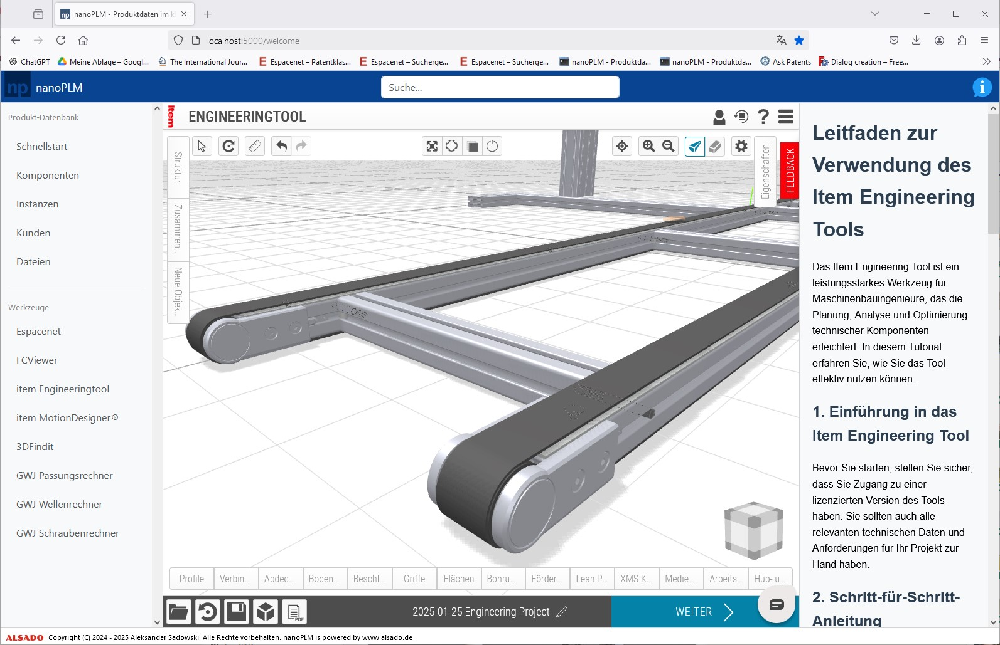

# nanoPLM
Open-Source PLM for small machine manufacturers - natively supports FreeCAD.

- Run locally without an internet connection.
- Keep all your data private.
- Focusing on ease of use - even beginners can install and use it.
- Priority treatment of FreeCAD compared to other CAD software, with the aim to further spread the word about it and making more manufacturers transition to FreeCAD.
- Automate your FreeCAD workflows from a central place.
- Support for all relevant languages in manufacturing, including English, German, French and others.
- Unique features that enable small manufacturers to compete against the big players.
- Compatible with Windows 10

:point_right: Watch nanoPLM Video Overview: 
[https://youtu.be/8V5PVpD8dvw](https://youtu.be/8V5PVpD8dvw)

## Product Development and Manufacturing Cycle in the European Union

- Artikel zu diesem Workflow (konstruktionspraxis, Deutsch): [https://www.konstruktionspraxis.vogel.de/wie-der-produktentstehungsprozess-mit-open-source-software-gelingt-a-2489d8720da4cc79f845bd795fcf81c4/](https://www.konstruktionspraxis.vogel.de/wie-der-produktentstehungsprozess-mit-open-source-software-gelingt-a-2489d8720da4cc79f845bd795fcf81c4/)
- Article about this workflow (GrabCAD, english): [https://grabcad.com/tutorials/succeeding-with-open-source-software-in-product-development](https://grabcad.com/tutorials/succeeding-with-open-source-software-in-product-development)

*nanoPLM* follows the following workflow from product development and manufacturing:
1. Technology research (Patents, scientific publications, existing products, catalogues)
2. Concept (Quick drawing (hand/powerpoint) with all its components and external effects)
3. Product safety assessment (Directive 2001/95/EC, risk assessment, ...)
4. Preliminary design (analytical calculations)
5. Detailed design (3D CAD, manufacturing and assembly drawings, simulation)
6. Testing (if necessary (safety, functional))
7. Manufacturing (in-house/ outsourced, development and manufacturing of manufacturing aids)
8. Quality assurance (100% control/ sample)

## Manage your product data in a small team
- Material id, image, name, description
- 3D CAD, drawings
- Patent documents (IP)
- Product brochures
- Machinery directive, CE marking, risk assessment, instructions manual, declaration of conformity
- Price buying, price selling
- ...

## Get nanoPLM

:point_right: Demo nanoPLM now:
[https://aleksanders.pythonanywhere.com](https://aleksanders.pythonanywhere.com)

:point_right: Download nanoPLM (exe, Windows 10, FreeCAD 0.21): 
[https://github.com/alekssadowski95/nanoPLM/releases/latest/download/openplm.zip](https://github.com/alekssadowski95/nanoPLM/releases/latest/download/openplm.zip)

## Contact
ALSADO Inh. Aleksander Sadowski 
Liebfrauenstraße 31 
53757 Sankt Augustin 
Germany 
Email: [info@alsado.de](mailto:info@alsado.de) 
Website: [https://www.alsado.de](https://www.alsado.de) 
